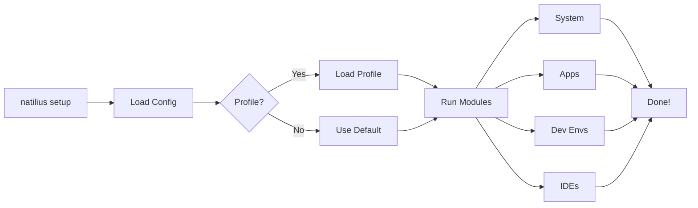

# Natilius


<p align="center">
  <strong>Set up your Mac for development in minutes, not hours.</strong>
</p>

<p align="center">
  
  
  
  
  
</p>

---

## What is Natilius?

Natilius automates Mac developer environment setup. Install 100+ tools, apps, and configurations with one command.

```bash
curl -fsSL https://raw.githubusercontent.com/vincentkoc/natilius/main/install.sh | bash
natilius setup
```

That's it. Go grab a coffee while Natilius configures everything.

---

## How It Works



---

## Features

| Feature | Description |
|---------|-------------|
| **One Command Setup** | Install 100+ tools, apps, and configurations |
| **Modular Design** | Enable only what you need |
| **Role-Based Profiles** | Pre-configured for DevOps, Frontend, Backend |
| **Idempotent** | Safe to run multiple times |
| **Terraform Ready** | Built for automation and CI/CD |
| **MDM Aware** | Works with Jamf, JumpCloud, Kandji, Intune |
| **Security Hardened** | FileVault, Firewall, Gatekeeper |

---

## What Gets Installed

=== "Languages"

    - **Python** — pyenv, pipenv, virtualenv
    - **Node.js** — nodenv, npm, yarn
    - **Ruby** — rbenv, bundler
    - **Go** — goenv
    - **Rust** — rustup, cargo
    - **Java** — jenv, Temurin JDK

=== "DevOps"

    - **Containers** — Docker, docker-compose
    - **Kubernetes** — kubectl, helm, k9s
    - **IaC** — Terraform, Ansible
    - **Cloud** — AWS CLI, Azure CLI

=== "Tools"

    - **Editors** — VS Code, JetBrains, Sublime
    - **Terminal** — iTerm2, tmux
    - **Git** — git, gh CLI, git-lfs
    - **Utilities** — jq, fzf, bat, htop

=== "Apps"

    - **Productivity** — Alfred, 1Password, Notion
    - **Communication** — Slack, Zoom
    - **Browsers** — Firefox, Brave
    - **And 50+ more...**

---

## Quick Start

### Install

=== "One-liner"

    ```bash
    /bin/bash -c "$(curl -fsSL https://raw.githubusercontent.com/vincentkoc/natilius/main/install.sh)"
    ```

=== "Homebrew"

    ```bash
    brew install vincentkoc/tap/natilius
    ```

=== "Manual"

    ```bash
    git clone https://github.com/vincentkoc/natilius.git ~/.natilius
    cd ~/.natilius && ./install.sh
    ```

### Run

```bash
natilius init          # Interactive setup wizard
natilius doctor        # Check your system
natilius setup --check # Preview changes (dry run)
natilius setup         # Install everything
```

> **Tip:** Install [gum](https://github.com/charmbracelet/gum) for a beautiful interactive experience: `brew install gum`

### Use Profiles

```bash
natilius profiles                       # List available profiles
natilius --profile minimal setup        # Essentials only
natilius --profile devops setup         # K8s, Terraform, cloud tools
natilius --profile developer setup      # Full dev environment
```

---

## System Requirements

- **macOS** 13 (Ventura) or later
- **Architecture** Intel or Apple Silicon (M1/M2/M3/M4)
- **Disk Space** ~10GB for full install
- **Internet** Required for initial setup

---

## Next Steps

- [Quick Start Guide](getting-started/quickstart.md) — Get up and running
- [Configuration](configuration/index.md) — Customize your setup
- [Profiles](configuration/profiles.md) — Role-based configurations
- [Enterprise & MDM](enterprise.md) — Jamf, JumpCloud, Intune integration
- [FAQ](faq.md) — Common questions
- [Comparison](comparison.md) — How Natilius compares to alternatives
